## Introduction

> **Note from the author:** This tutorial was written for [community.hetzner.com](https://community.hetzner.com/) and was published by them, but then [it was deleted](https://github.com/hetzneronline/community-content/pull/987). Thus, I am publishing it here. Hope it helps.

[Xray](https://github.com/XTLS/Xray-core) is a proxy with support for multiple network protocols. It's commonly used to penetrate firewalls to access blocked websites and apps. Xray is created by Chinese developers and is a fork of [V2Ray](https://github.com/v2fly/v2ray-core). This is why some documentation is only available in Chinese. There are many ways to configure Xray, depending on a use case and blocking that you want to circumvent. I will show you a simple configuration that works well for me.

**Prerequisites**

* A user with sudo privileges

## Step 1 - Installing Xray-core on the server

Connect to your server via SSH.

Install the `unzip` package using your package manager. Run the command below to download and install `xray` to the `/usr/local/xray` directory:

```bash
cd ~ \
&& curl -fLo xray.zip "https://github.com/XTLS/Xray-core/releases/latest/download/Xray-linux-$(uname -m | sed -e s/x86_64/64/ -e s/aarch64/arm64-v8a/).zip" \
&& sudo unzip -d /usr/local/xray xray.zip \
&& rm xray.zip
```

Add `xray` to your `PATH` by executing:

```bash
export PATH=$PATH:/usr/local/xray
```

You need to add the line above to your `~/.profile` to preserve the change between logins.

Run the following command to check that `xray` is installed properly:

```bash
xray version
```

If you need to update `xray`, run `sudo rm -r /usr/local/xray` and repeat [step 1](#step-1---installing-xray-core-on-the-server) again.

## Step 2 - Server configuration

You need to create a configuration file for your Xray server.

First, create the directory where the configuration file will be stored:

```bash
sudo mkdir -p /usr/local/etc/xray
```

The skeleton of the server configuration (e.g. `/usr/local/etc/xray/config.json`) looks like this:

```json
{
    "log": {
        "loglevel": "warning"
    },
    "inbounds": [
        {
            "port": 443,
            "protocol": "vless",
            "settings": {
                "clients": [],
                "decryption": "none"
            },
            "streamSettings": {
                "network": "tcp",
                "security": "tls",
                "tlsSettings": {
                    "certificates": []
                }
            }
        }
    ],
    "outbounds": [
        {
            "protocol": "freedom"
        }
    ]
}
```

* 443 (https) port is used by `xray` here. It's a privileged port (less than 1024) and some additional configuration will be needed to run `xray` as a non-root user. You can choose some other port if you want.
* `inbounds` define which protocols are accepted for incoming requests (only VLESS in this case), and `outbounds` define how the request is proxied (`"freedom"` means that Xray sends it to the appropriate destination).
* To be able to accept requests from clients, you need to add them to `inbounds[].settings.clients`, which will be shown later.
* `inbounds[].streamSettings` specify how the data gets sent over the wire. Protocols that you define here are used to penetrate the firewall. TCP with TLS encryption is used here. Other protocols are available, for example WebSockets.
* `inbounds[].streamSettings.tlsSettings.certificates` is empty for now. In the steps below, you will create a certificate and add it here.

Now, let's add the first client. The client object looks like this: <a name="client_uuid"></a>

* `id` is used for client authentication. You can think of it like the user password.
* `email` is used to distinguish clients in the logs. This doesn't need to be a valid email address. You can just put the name of the person for which you want to add a client.

```json
{
    "id": "<User UUID>",
    "email": "<Name or email>"
}
```

To generate the user ID (UUID) run the following command:

```bash
xray uuid
```

Put the result into the `id` field.

Now, put your client configuration into the `inbounds[].settings.clients` array in the server configuration.

<details>

<summary>After you added the client, the configuration will look like this:</summary>

* Don't forget to replace the client ID with your own.

```json
{
    "log": {
        "loglevel": "warning"
    },
    "inbounds": [
        {
            "port": 443,
            "protocol": "vless",
            "settings": {
                "clients": [
                    {
                        "id": "4d6e0338-f67a-4187-bca3-902e232466bc",
                        "email": "John"
                    }
                ],
                "decryption": "none"
            },
            "streamSettings": {
                "network": "tcp",
                "security": "tls",
                "tlsSettings": {
                    "certificates": []
                }
            }
        }
    ],
    "outbounds": [
        {
            "protocol": "freedom"
        }
    ]
}
```

</details>

Additional clients can be added in the same way.

You need to generate the TLS certificate. It will be used to establish an encrypted connection between client and server. There are two ways to do it. You can generate a self-signed certificate, this way you don't need a domain attached to your server. Alternatively, you can obtain a certificate from Let's Encrypt for your domain.

<details>

<summary>Generate a self-signed certificate.</summary>

Run the following command:

```bash
sudo /usr/local/xray/xray tls cert -file /usr/local/etc/xray/my > /dev/null
```

Two files will be created:

* `/usr/local/etc/xray/my_cert.pem` is your self-signed certificate.
* `/usr/local/etc/xray/my_key.pem` is your private key.

Now you need to create a JSON object for the certificate and add it to your Xray server configuration.

The certificate object will look like this:

```json
{
    "certificateFile": "/usr/local/etc/xray/my_cert.pem",
    "keyFile": "/usr/local/etc/xray/my_key.pem"
}
```

Put it into the `inbounds[].streamSettings.tlsSettings.certificates` array in the server configuration.

<details>

<summary>After you added self-signed certificate, the configuration will look like this:</summary>

```json
{
    "log": {
        "loglevel": "warning"
    },
    "inbounds": [
        {
            "port": 443,
            "protocol": "vless",
            "settings": {
                "clients": [
                    {
                        "id": "4d6e0338-f67a-4187-bca3-902e232466bc",
                        "email": "John"
                    }
                ],
                "decryption": "none"
            },
            "streamSettings": {
                "network": "tcp",
                "security": "tls",
                "tlsSettings": {
                    "certificates": [
                        {
                            "certificateFile": "/usr/local/etc/xray/my_cert.pem",
                            "keyFile": "/usr/local/etc/xray/my_key.pem"
                        }
                    ]
                }
            }
        }
    ],
    "outbounds": [
        {
            "protocol": "freedom"
        }
    ]
}
```

</details>

---

<br><br>

</details>

<details>

<summary>Obtain a certificate from Let's Encrypt for your domain.</summary>

**Prerequisites**

* A domain name, e.g. `example.com` with an `A` and optionally an `AAAA` DNS record pointing to your server.
* `certbot` package is installed [using Snap](https://certbot.eff.org/instructions?ws=other&os=snap) (preferred) or package manager of your distribution.

Run the following command to get a certificate for your domain:

* Replace `user@example.com` with your email.
* Replace `example.com` with your domain for which you want to generate a certificate.

```bash
sudo certbot certonly --standalone --agree-tos -m user@example.com -d example.com
```

> **Note:** Xray supports hot reloading of certificates, that is you don't need to do anything when your certificate is renewed by Certbot.

Certificate and private key will be saved into the `/etc/letsencrypt/live/example.com` directory, where `example.com` is your domain.

You will need two files:

* `/etc/letsencrypt/live/example.com/fullchain.pem` is your certificate issued by Let's Encrypt.
* `/etc/letsencrypt/live/example.com/privkey.pem` is your private key.

You need to change permissions if you want to run `xray` as a non-root user.

* Replace `example.com` with your domain.

```bash
mydomain=example.com
sudo chmod a+rx /etc/letsencrypt/{live,archive}
sudo chgrp $USER "/etc/letsencrypt/live/$mydomain/privkey.pem"
sudo chmod g+r "/etc/letsencrypt/live/$mydomain/privkey.pem"
```

Now you need to create a JSON object for the certificate and add it to your Xray server configuration.

The certificate object will look like this:

* Replace `example.com` with your domain.

```json
{
    "certificateFile": "/etc/letsencrypt/live/example.com/fullchain.pem",
    "keyFile": "/etc/letsencrypt/live/example.com/privkey.pem"
}
```

Put it into the `inbounds[].streamSettings.tlsSettings.certificates` array in the server configuration.

<details>

<summary>After you added your Let's Encrypt certificate, the configuration will look like this:</summary>

```json
{
    "log": {
        "loglevel": "warning"
    },
    "inbounds": [
        {
            "port": 443,
            "protocol": "vless",
            "settings": {
                "clients": [
                    {
                        "id": "4d6e0338-f67a-4187-bca3-902e232466bc",
                        "email": "John"
                    }
                ],
                "decryption": "none"
            },
            "streamSettings": {
                "network": "tcp",
                "security": "tls",
                "tlsSettings": {
                    "certificates": [
                        {
                            "certificateFile": "/etc/letsencrypt/live/example.com/fullchain.pem",
                            "keyFile": "/etc/letsencrypt/live/example.com/privkey.pem"
                        }
                    ]
                }
            }
        }
    ],
    "outbounds": [
        {
            "protocol": "freedom"
        }
    ]
}
```

</details>

---

<br><br>

</details>

The configuration is complete and you can put it into the file:

```bash
sudo nano /usr/local/etc/xray/config.json
```

You can test your configuration for errors using the following command: <a name="server_start"></a>

```bash
xray run -test -c /usr/local/etc/xray/config.json
```

If you're using port 443 (https) in your configuration, you need to run the following command. This will allow `xray` to bind the port without requiring root privileges.

```bash
sudo setcap cap_net_bind_service=+ep /usr/local/xray/xray
```

You can run `xray` in the foreground for testing, logs will be printed to your terminal:

```bash
xray run -c /usr/local/etc/xray/config.json
```

When you are sure that your configuration is correct, you can run the following command to create a systemd service file to run `xray` in the background:

* `xray` starts with the permissions of your current user.
* `Restart` directive is used to restart the server if `xray` exits unexpectedly.
* `[Install]` section is used to automatically start the service on system boot.

```bash
echo "[Unit]
Description=xray-core
After=network-online.target
Wants=network-online.target

[Service]
User=$USER
Type=exec
ExecStart=/usr/local/xray/xray -c /usr/local/etc/xray/config.json
Restart=on-failure

[Install]
WantedBy=multi-user.target" | sudo tee /etc/systemd/system/xray.service
```

Now you can start up `xray` and configure it to always start up on system boot:

```bash
sudo systemctl start xray && sudo systemctl enable xray
```

## Step 3 - Client configuration

In [step 2](#step-2---server-configuration) you created a client object and added it to your server configuration.
The client ID from this object is used to configure your Xray client device to prevent unauthorized access to your Xray server.

* [Android client](#step-31---android-client)
* [Windows client](#step-32---windows-client)
* [Linux client](#step-33---linux-client)

### Step 3.1 - Android client

This step will show you how to configure an Xray client on an Android device.

Install [v2rayNG](https://play.google.com/store/apps/details?id=com.v2ray.ang) on your Android device.

1. Open v2rayNG and tap `+`:

   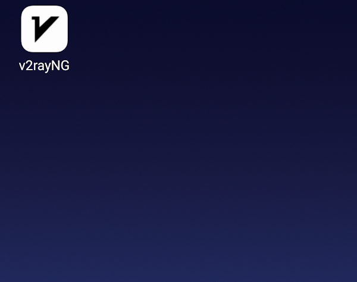

   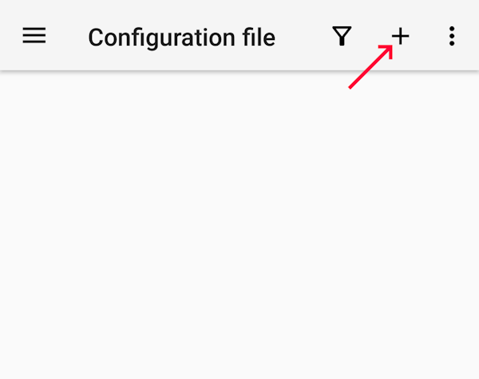

2. Choose _Type manually[VLESS]_:

   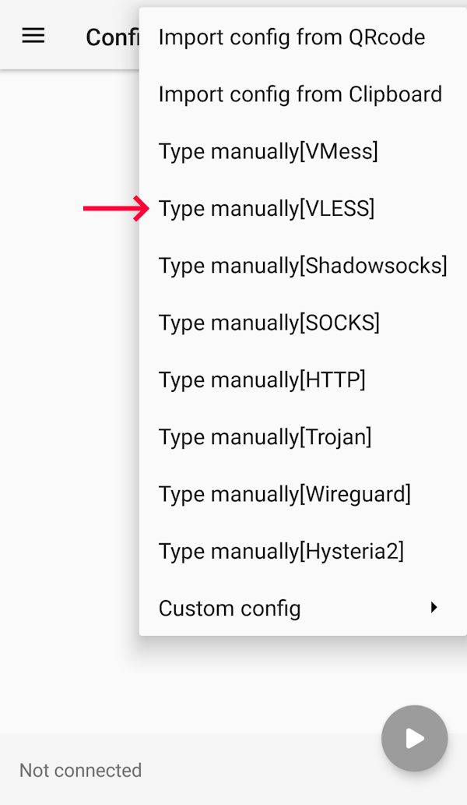

3. Fill in fields in the configuration: <a name="vless_config"></a>

   * Replace `example.com` in _address_ with your domain. If you're using a **self-signed certificate**, fill in _address_ with an IP address of your server.
   * Put your client ID into the _id_ field. It should be the same client ID that you added in the [server configuration](#step-2---server-configuration).

   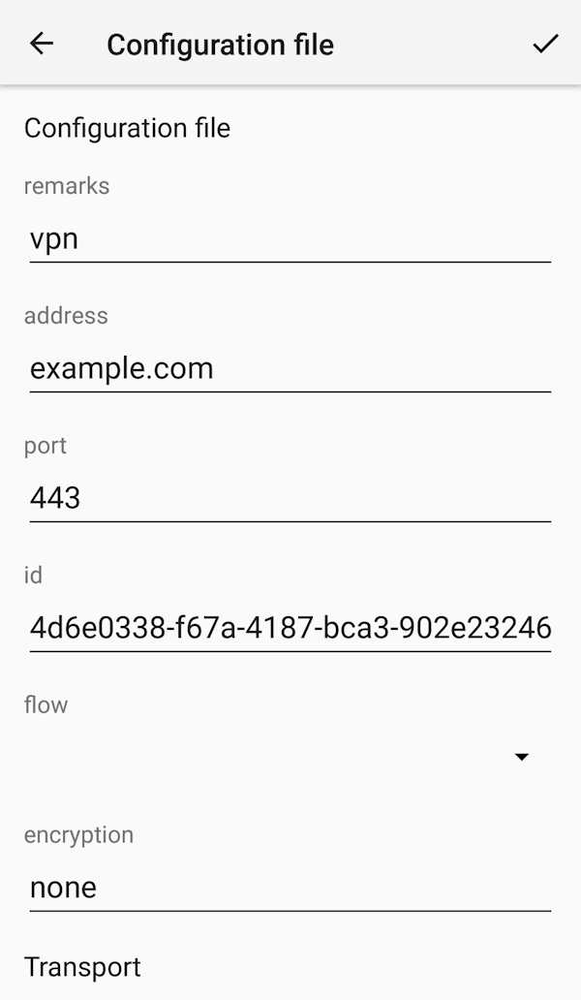

4. Scroll and change TLS settings:

   Open _TLS_ menu and select _tls_.

   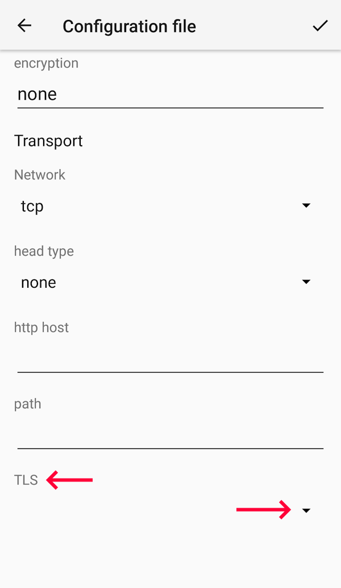

   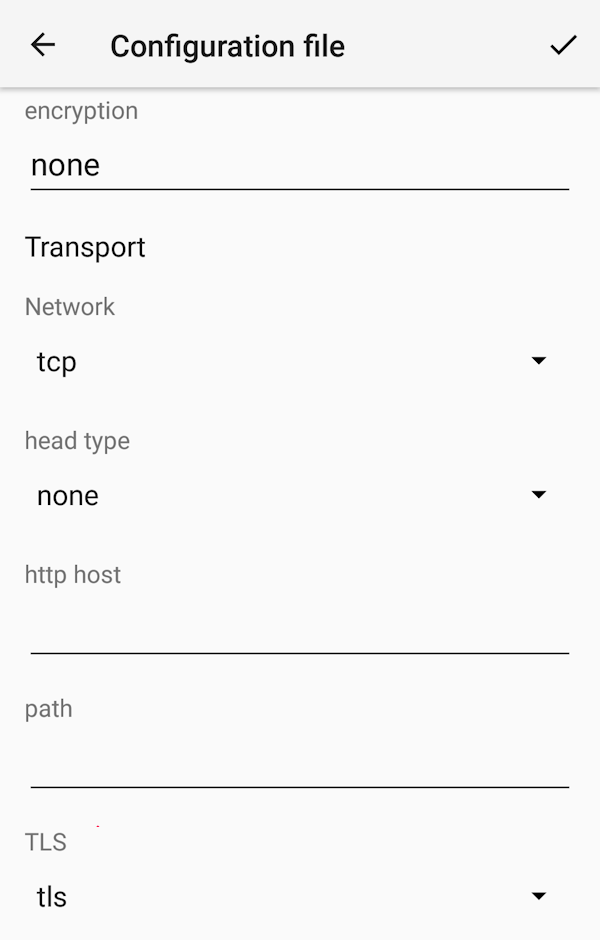

5. If you're using a **self-signed certificate**, open the _allowInsecure_ menu and select _true_.

   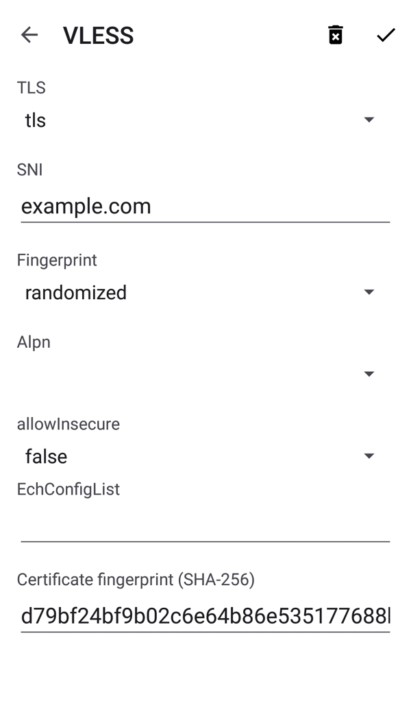

   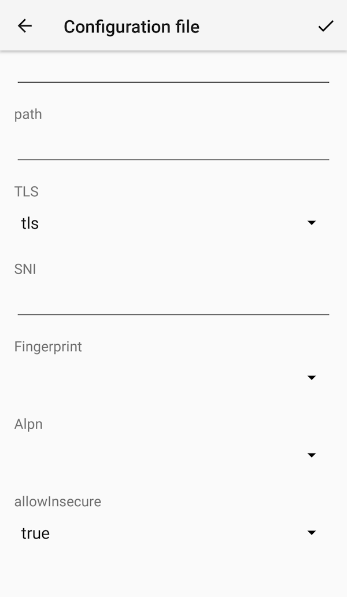

6. Save your configuration:

   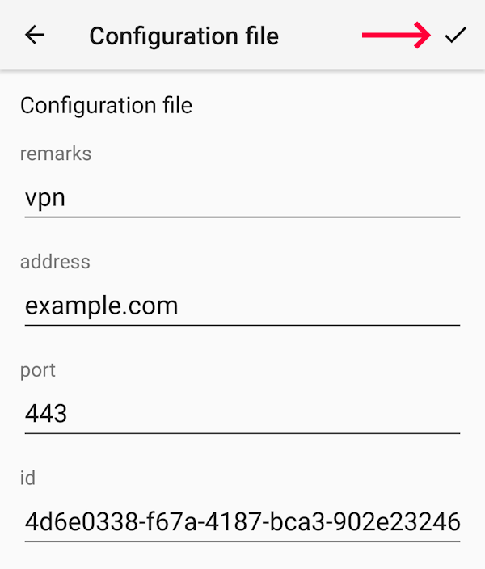

7. Tap the _play_ button to connect to your Xray server:

   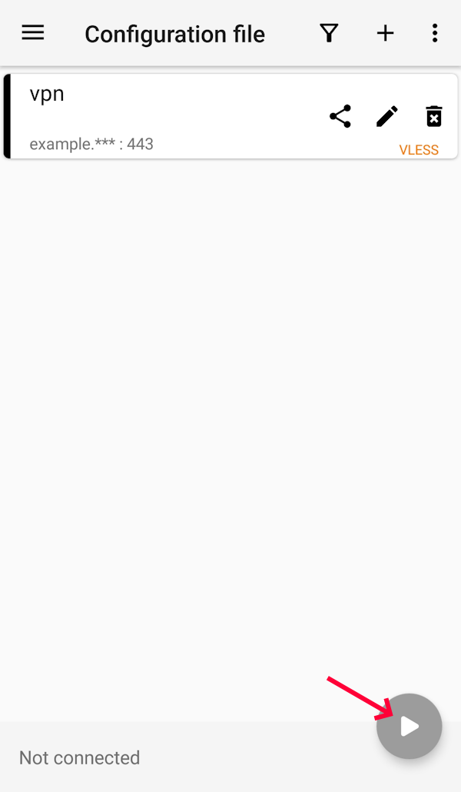

   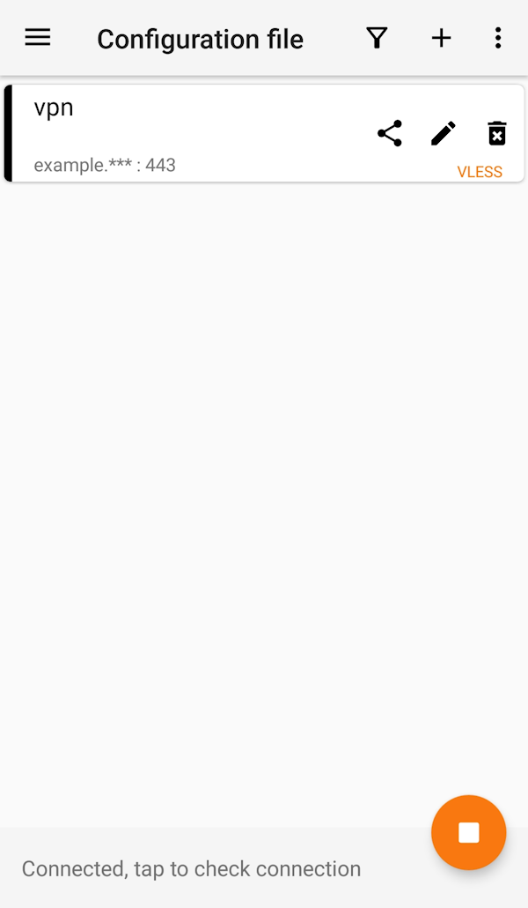

8. Tap to check the connection, it should be successful: <a name="check_connection"></a>

   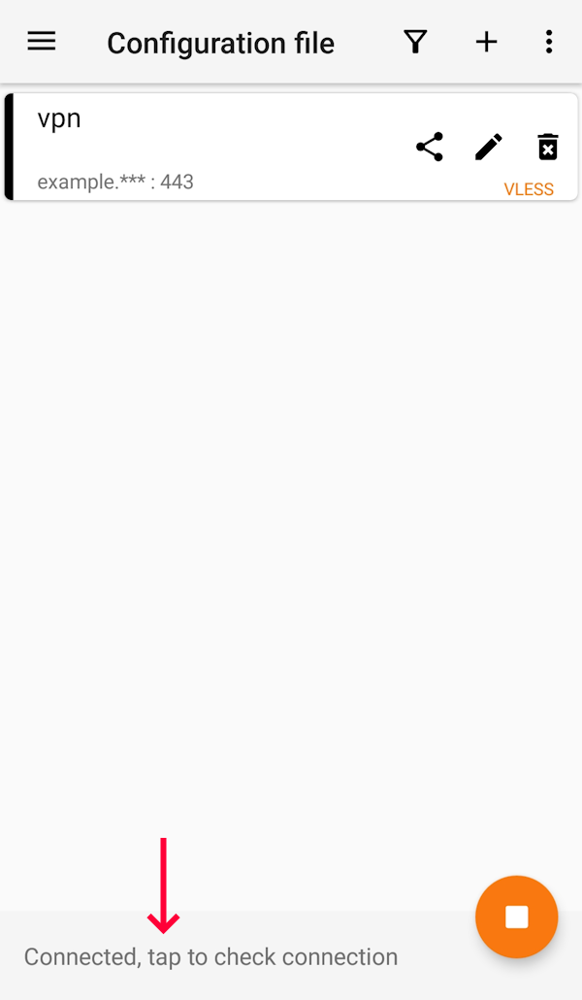

   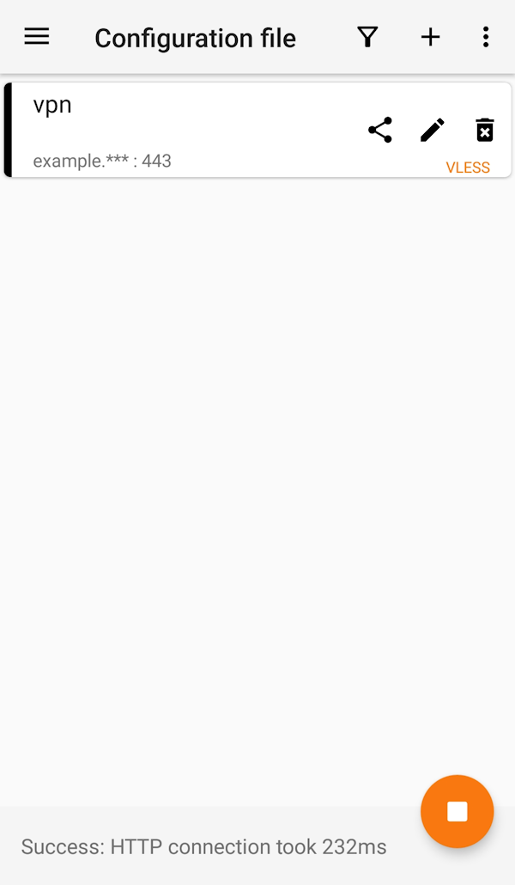

Try to access blocked websites and apps. They should work now.

### Step 3.2 - Windows client

You need to download the [latest Xray release for Windows](https://github.com/XTLS/Xray-core/releases/latest) for your architecture. Most likely you will need `Xray-windows-64.zip`.

You can do it manually or open PowerShell and execute the commands below. Xray will be downloaded and extracted to your home directory.

```powershell
cd ~
curl.exe -fLo xray.zip https://github.com/XTLS/Xray-core/releases/latest/download/Xray-windows-64.zip
Expand-Archive xray.zip xray
rm xray.zip
cd xray
pwd
```

Path to directory with `xray.exe` binary is printed to your terminal. Add it to your **system PATH**. How to modify your system PATH is [explained here](https://community.hetzner.com/tutorials/obfuscating-wireguard-using-wstunnel#step-32---windows-client).

Open PowerShell and run the following command to check that PATH is updated properly:

```powershell
xray version
```

There are two ways to configure Xray on Windows.

The first one is to use it as a SOCKS proxy, which is supported by Firefox, Chrome and other apps. Only apps that are specifically configured to use that SOCKS proxy will be routed through Xray.

Alternatively, you can configure Xray to work like VPN to route all your traffic through Xray. In this case you don't need to configure individual apps to use proxy.

* [SOCKS proxy](#step-321---socks-proxy)
* [Route all your traffic through the proxy](#step-322---route-all-your-traffic-through-the-proxy)

### Step 3.2.1 - SOCKS proxy

To configure your Xray client as a SOCKS proxy, use the following configuration.

* Replace `example.com` with your domain.

  If you're using a **self-signed certificate**, replace `example.com` with your server IP. Additionally set `"allowInsecure": true`.
* Replace `id` with your client `id` from the [server configuration](#step-2---server-configuration).
* `443` is the port on which the Xray server listens. It's the same port that is used in the [server configuration](#step-2---server-configuration).
* `1080` is the port on which the local SOCKS proxy server listens. It will accept connections from your apps that are configured to use it.

  Apps that want to use the SOCKS proxy need to set `127.0.0.1` as a host, and `1080` as a port.

```json
{
    "log": {
        "loglevel": "warning"
    },
    "inbounds": [
        {
            "listen": "127.0.0.1",
            "port": "1080",
            "protocol": "socks",
            "settings": {
                "udp": true,
                "ip": "127.0.0.1"
            }
        }
    ],
    "outbounds": [
        {
            "protocol": "vless",
            "settings": {
                "vnext": [
                    {
                        "address": "example.com",
                        "port": 443,
                        "users": [
                            {
                                "id": "4d6e0338-f67a-4187-bca3-902e232466bc",
                                "encryption": "none",
                                "level": 0
                            }
                        ]
                    }
                ]
            },
            "streamSettings": {
                "network": "tcp",
                "security": "tls",
                "tlsSettings": {
                    "allowInsecure": false
                }
            }
        }
    ]
}
```

Run the commands below to put it into the file `xray_config.json` in your HOME directory and run `xray` with that configuration.

```powershell
notepad "$env:USERPROFILE\xray_config.json"
xray run -c "$env:USERPROFILE\xray_config.json"
```

Now, `xray` is running and you can configure your apps to use a SOCKS proxy.

* **Use a SOCKS proxy with Google Chrome** <a name="windows_apps"></a>

  Find the Google Chrome shortcut and open its _Properties_.

  Change _Target_ from

  ```
  "C:\Program Files\Google\Chrome\Application\chrome.exe"
  ```
  to
  ```
  "C:\Program Files\Google\Chrome\Application\chrome.exe" --proxy-server="socks5://127.0.0.1:1080"
  ```

  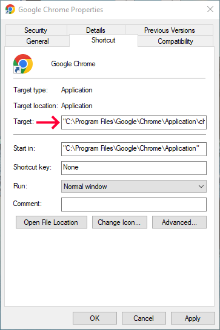

  Click _Apply_ and then _OK_.

  **Close all Chrome windows** to apply your change. Open Chrome and try to browse the web, it should be using the Xray SOCKS proxy now.

  Alternatively, instead of changing the existing shortcut you can copy it, and configure the copy to use the SOCKS proxy. This way you can have one Chrome shortcut that uses proxy, and one that doesn't.

<br>

* **Use a SOCKS proxy with Firefox** <a name="firefox_socks"></a>

  Consult [the official documentation](https://support.mozilla.org/en-US/kb/connection-settings-firefox). Fill in _SOCKS Host_ with `127.0.0.1` and corresponding _Port_ with `1080`. Click _SOCKS v5_ and select _Proxy DNS when using SOCKS v5_.

  Many other programs support SOCKS as well. Consult their documentation to learn how to configure it.

### Step 3.2.2 - Route all your traffic through the proxy

You need to download the `zz_v2rayN-With-Core-SelfContained.7z` archive from the [latest release of v2rayN](https://github.com/2dust/v2rayN/releases/latest). Extract it using [7-Zip](https://www.7-zip.org/).

1. Open the extracted directory and run the `v2rayN.exe` binary **as Administrator**.

2. Click _Servers_:

   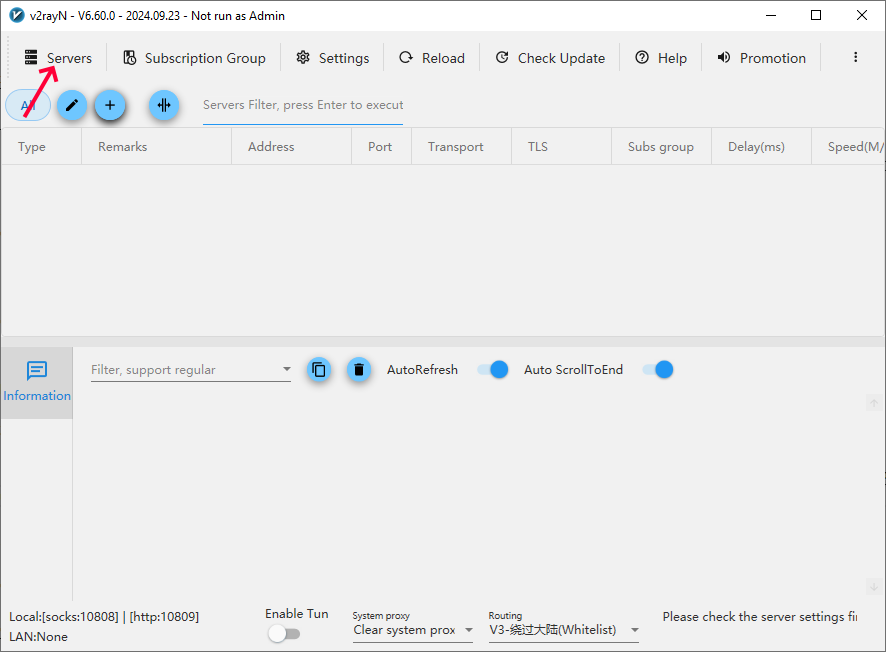

3. Click _Add [VLESS] server_:

   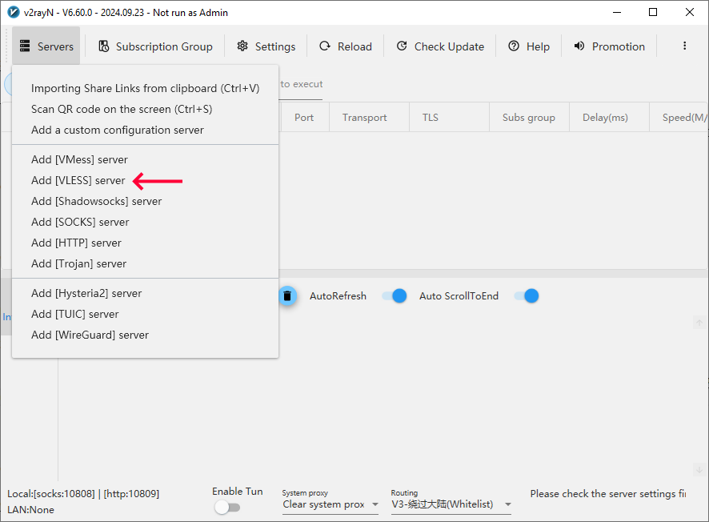

4. Fill in the fields in the same way as [described for an Android client](#vless_config) and click _Confirm_. Restart v2rayN.

   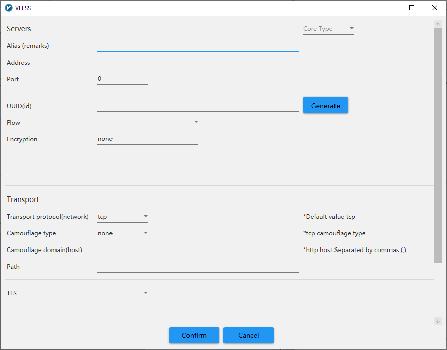

   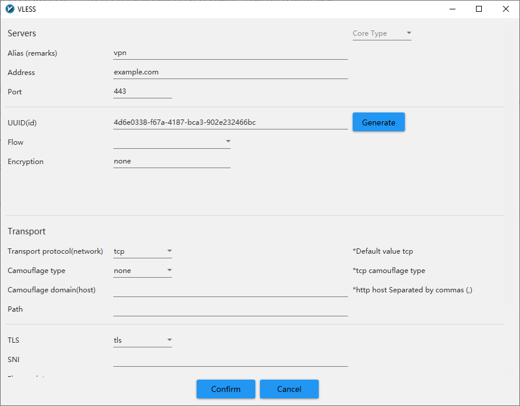

5. Click _Enable Tun_:

   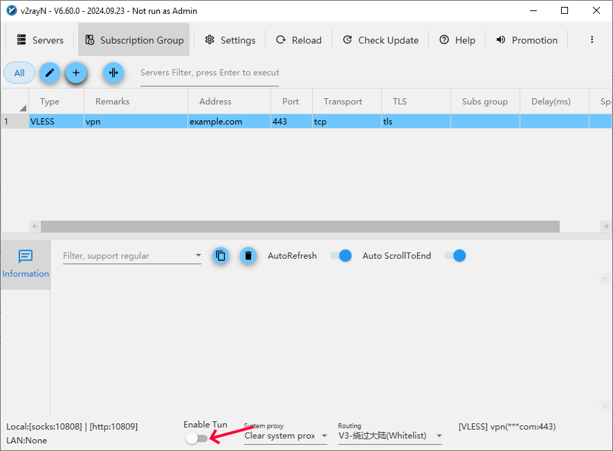

After that all your traffic should go through the Xray proxy.

>**Note:** Sometimes the _Enable Tun_ doesn't work from the first try. In the log, you will see errors like these:
>
> ```
> WARN inbound/tun[tun-in]: open tun interface take too much time to finish!
> FATAL[0016] start service: initialize inbound/tun[tun-in]: configure tun interface: Cannot create a file when that file already exists.
> ```
>
> Try to switch _Enable Tun_ on and off a few times. Take a look at your network connections in the Windows settings. After _Enable Tun_ is activated, the *singbox_tun* network connection should be present there.
>
> 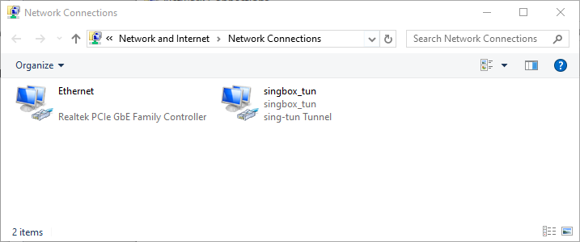

### Step 3.3 - Linux client

Xray on a Linux client can be installed in the same way [as on a Linux server in step 1](#step-1---installing-xray-core-on-the-server). You can run Xray as a service which is described [at the end of step 2](#step-2---server-configuration). Except the configuration file will be different.

Create the configuration file.

```bash
sudo mkdir -p /usr/local/etc/xray
sudo nano /usr/local/etc/xray/config.json
```

Configuration will be the same as in [step 3.2.1 for the Windows client](#step-321---socks-proxy). Adjust the configuration as described there. Save the file and run the command below to start Xray.

```bash
xray run -c /usr/local/etc/xray/config.json
```

Now, `xray` is running and you can configure your apps to use a SOCKS proxy.

### Step 3.3.1 -  Use a SOCKS proxy with Google Chrome (Chromium)

Close all Chrome windows and run the following command:

* In this case the name of the binary is `google-chrome`, on your system it may be different. For example, it can be called `chromium`.

```bash
google-chrome --proxy-server="socks5://127.0.0.1:1080"
```

### Step 3.3.2 - Use a SOCKS proxy with Firefox

[It's configured in the same way as on Windows.](#firefox_socks)

### Step 3.3.3 - Set _Network Proxy_ in GNOME

In GNOME you can set a system-wide SOCKS proxy which will be used by all apps that support it automatically.
Follow the steps below.

1. Open the network settings and click the gear symbol in _Network Proxy_:

   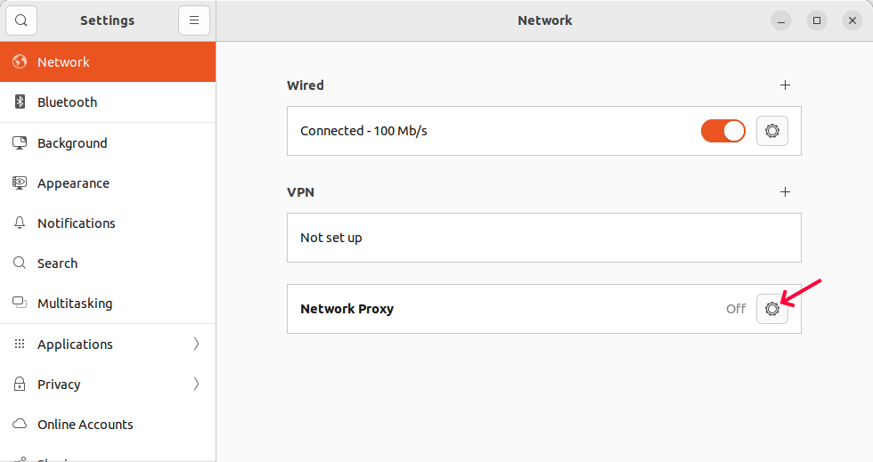

2. Click _Manual_:

   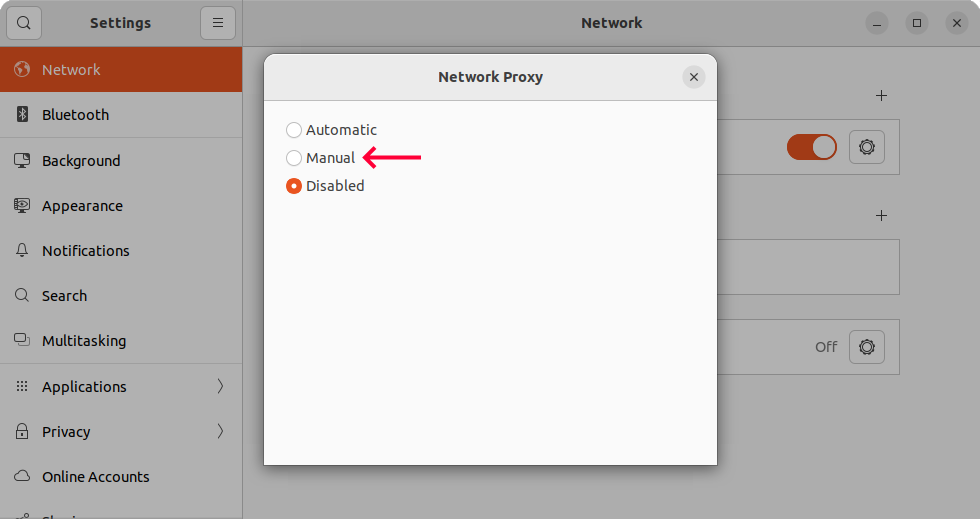

3. Fill in _Socks Host_ with `127.0.0.1` and port with `1080`:

   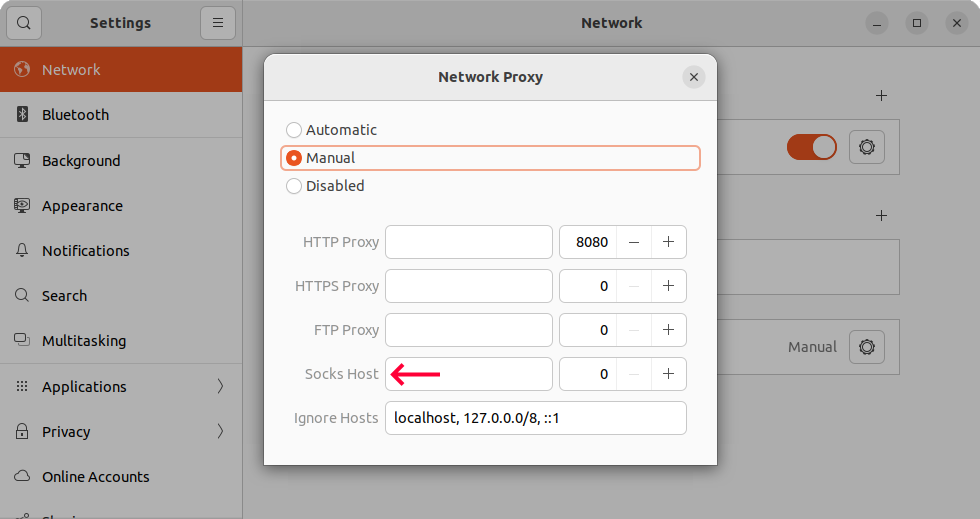

   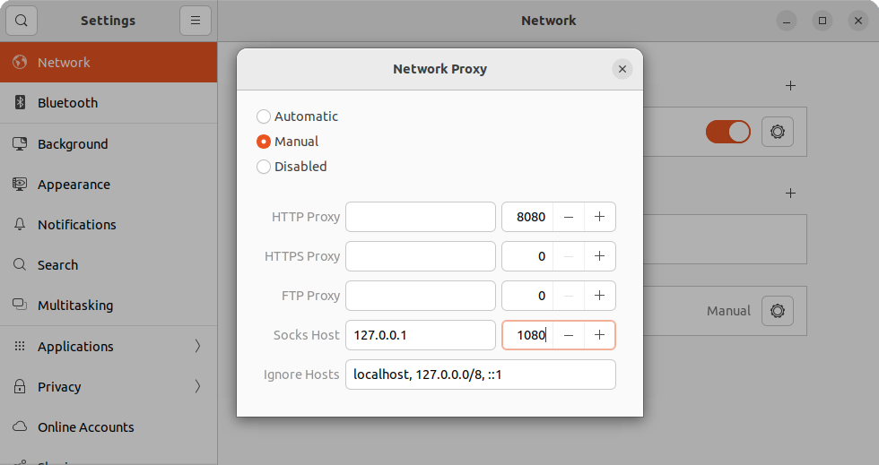

Open the browser and test your Internet connection, it should go through the proxy now.

## Step 4 - Cloudflare proxy

If your server IP got blocked you will not be able to directly connect to your Xray server. You need an intermediate server through which you would connect. Cloudflare can be used as such a server.

You need a domain if you don't have one yet. You need an apex domain (doesn't contain subdomain) e.g. `example.com`, not `sub.example.com`.

> **Note:**
> You can find a cheap domain to register using [TLD List](https://tld-list.com). Domains are usually cheap when you register them and expensive when you renew. But you don't need to renew this domain, when it expires. You can just register a new one.

Go to https://cloudflare.com and create an account. [Add your domain and configure it](https://developers.cloudflare.com/dns/zone-setups/full-setup/setup/) by putting Cloudflare nameservers in the domain settings of your domain register.

Now you need to add an `A` and optionally `AAAA` DNS record with an IP address of your server, i.e. an IP to which you can't directly connect, and access to which will be proxied by Cloudflare. Go to your domain in the Cloudflare dashboard and open _DNS_ > _Records_ and click _Add record_. Add an `A` record with name `@` and proxy enabled:

* Replace `10.0.0.1` with your server IP address.

| Type | Name | IPv4 address | Proxy status | TTL |
| ---  | --- |  --- | --- | --- |
| A | @ | 10.0.0.1 | On | Auto |

After you have done that, the result will be similar to the image below:

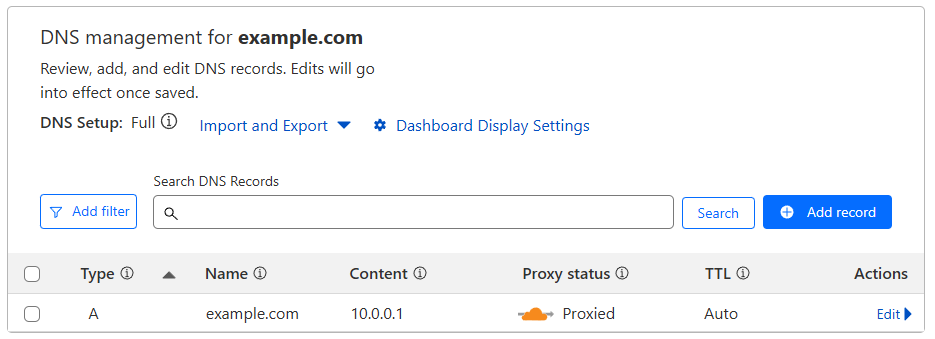

Now, go to _SSL/TLS_ and click _Configure_. Click _Full_ if you're using a self-signed certificate. Or click _Full (Strict)_ if you're using the Let's Encrypt certificate.

Click _Network_ in the sidebar and make sure that _WebSockets_ are enabled.

It's time to change your server and client's configuration. The transport should be changed from `tcp` to `ws` (WebSocket), which Cloudflare supports.

### Step 4.1 - Server configuration

In your Xray server `streamSettings` replace `tcp` with `ws`.

<details>

<summary>After you replaced <code>tcp</code> with <code>ws</code>, your server configuration will look like this:</summary>

```json
{
    "log": {
        "loglevel": "warning"
    },
    "inbounds": [
        {
            "port": 443,
            "protocol": "vless",
            "settings": {
                "clients": [
                    {
                        "id": "4d6e0338-f67a-4187-bca3-902e232466bc",
                        "email": "John"
                    }
                ],
                "decryption": "none"
            },
            "streamSettings": {
                "network": "ws",
                "security": "tls",
                "tlsSettings": {
                    "certificates": [
                        {
                            "certificateFile": "/etc/letsencrypt/live/example.com/fullchain.pem",
                            "keyFile": "/etc/letsencrypt/live/example.com/privkey.pem"
                        }
                    ]
                }
            }
        }
    ],
    "outbounds": [
        {
            "protocol": "freedom"
        }
    ]
}
```

</details>

### Step 4.2 - Android client

1. Open v2rayNG and tap pencil to edit your configuration:

   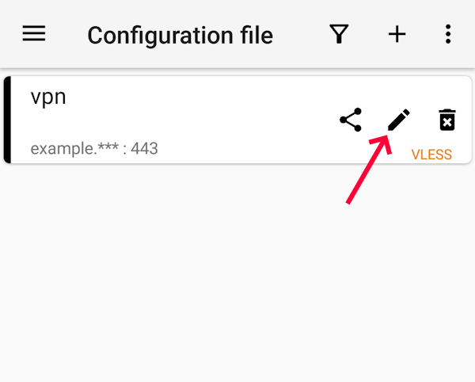

2. Fill in _address_ with your domain and select _ws_ as _Network_:

   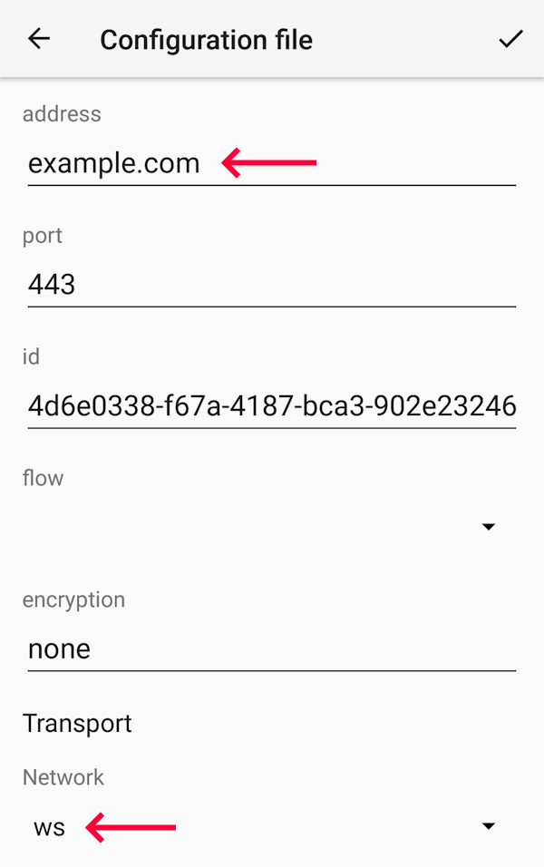

3. Save your configuration:

   

4. Activate VPN and [check your connection](#check_connection).

### Step 4.3 - Windows and Linux client

Use your domain as an `address` and replace `tcp` with `ws` in `streamSettings`.

<details>

<summary>After you made those changes, the configuration for SOCKS proxy will look like this:</summary>

```json
{
    "log": {
        "loglevel": "warning"
    },
    "inbounds": [
        {
            "listen": "127.0.0.1",
            "port": "1080",
            "protocol": "socks",
            "settings": {
                "udp": true,
                "ip": "127.0.0.1"
            }
        }
    ],
    "outbounds": [
        {
            "protocol": "vless",
            "settings": {
                "vnext": [
                    {
                        "address": "example.com",
                        "port": 443,
                        "users": [
                            {
                                "id": "4d6e0338-f67a-4187-bca3-902e232466bc",
                                "encryption": "none",
                                "level": 0
                            }
                        ]
                    }
                ]
            },
            "streamSettings": {
                "network": "ws",
                "security": "tls"
            }
        }
    ]
}
```

</details>

## Step 5 - Configuring XTLS Vision and Reality

If the blocking is severe and the domain whitelist is used to determine if the connection will be allowed or blocked, the configuration described in [Step 2](#step-2---server-configuration)
and [Step 4](#step-4---cloudflare-proxy) will not work. You need to masquerade your Xray server as one of the whitelisted websites, for connection
to be successful.

**What is XTLS and Reality?**

To put it simply, XTLS technology is used to prevent double encryption of packets, one between the Xray client and server, and one by your browser and the target website. XTLS allows you to use only one layer of encryption, established by your browser.

Reality on the other hand is needed to make your connections to Xray server appear like a visit to a legitimate and whitelisted website,
thus, preventing blocking of your connections.

**Prerequisites**

* Generate a key pair that will be used to protect your Xray Reality server. <a name="generate_key"></a>

  Run in your shell:

  ```bash
  xray x25519
  ```

  Save the output, it will be used later.

  _Public key_ will be used as a `password` in a client configuration.

  _Private key_ will be used as `privateKey` in a server configuration.

  I will use the following keys in the examples below:

  ```
  Private key: iOEARLzm7u7VJoygXXK8b1Nt6eQsoyYgFP8_3cOLtXE
  Public key: onBX9VWPbGC3tIELZ9jblx7Hyu2aY4SPag1oxXHE41M
  ```

* Find a website that is outside of your country's firewall and which is not blocked, i.e. you can access it without VPN. <a name="choose_domain"></a>
  This website should not use Cloudflare proxy, it must support TLS 1.3 and HTTP/2 protocols. See below how to check this.

  Your Xray Reality server will masquerade as a web server that hosts this website.

  Most websites support TLS 1.3 nowadays. But if you want to check it anyway, run the following command:

  * Replace `example.com` with a target website.

  ```bash
  curl --tlsv1.3 https://example.com
  ```

  If you don't get an error: `alert handshake failure`, then it's supported.

  HTTP/2 support on the other hand is hit-and-miss, run the following command to test it:

  ```bash
  curl -v --http2 https://example.com > /dev/null
  ```

  Check the request and response headers, they should contain:

  ```
  > GET / HTTP/2
  ...
  < HTTP/2 200
  ```

  To find out if the website uses Cloudflare, you can check its DNS NS records or use a service like [Who Hosts This](https://www.who-hosts-this.com).
  To check the NS records, run:

  ```bash
  dig example.com NS
  ```

In the following server and client configurations you will need to replace `example.com` with your chosen website that supports TLS 1.3 and HTTP/2,
and `10.0.0.1` with an **IP of your server**, where Xray is installed.

### Step 5.1 - Xray Reality server configuration

The configuration below creates a server with XTLS Vision and Reality support listening on 443 port.
It contains a client with a property `flow` set to `xtls-rprx-vision` which enables XTLS support.
How to generate an id for a client is [described previously](#client_uuid).

Create `config.json` with the following content:

* Replace `example.com` with a [chosen domain](#choose_domain).
* Replace `privateKey` with a private key that [you generated](#generate_key).

```json
{
    "log": {
        "loglevel": "warning"
    },
    "inbounds": [
        {
            "port": 443,
            "protocol": "vless",
            "settings": {
                "clients": [
                    {
                        "id": "4d6e0338-f67a-4187-bca3-902e232466bc",
                        "email": "John",
                        "flow": "xtls-rprx-vision"
                    }
                ],
                "decryption": "none"
            },
            "streamSettings": {
                "network": "raw",
                "security": "reality",
                "realitySettings": {
                    "dest": "example.com:443",
                    "serverNames": [
                        "example.com"
                    ],
                    "privateKey": "iOEARLzm7u7VJoygXXK8b1Nt6eQsoyYgFP8_3cOLtXE",
                    "shortIds": [
                        ""
                    ]
                }
            }
        }
    ],
    "outbounds": [
        {
            "protocol": "freedom"
        }
    ]
}
```

Now, you can [start your server](#server_start).

If you run the command below it should print the same content that would be returned if you access `example.com` directly.
In other words, your Xray server masquerades as a web server for the `example.com` website.
Where `example.com` is a [whitelisted  domain chosen by you](#choose_domain) for Reality configuration.

* Replace `example.com` with a [chosen domain](#choose_domain) and `10.0.0.1` with an **IP of your server**.

```bash
curl --resolve example.com:443:10.0.0.1 https://example.com
```

You're ready to configure your client devices.

### Step 5.2 - Xray Reality SOCKS proxy client configuration

The client configuration below starts SOCKS proxy server that you can use to access the Internet through your Xray Reality server.
You can [configure your apps on Windows](#windows_apps) and [Linux](#step-331----use-a-socks-proxy-with-google-chrome-chromium) to use this SOCKS proxy.

Create the `config.json` file with the following content:

And adjust these two settings:

* `id` corresponds to an `id` of the client in [server configuration](#step-51---xray-reality-server-configuration).
* `password` is the **public** key that [you generated](#generate_key).

```json
{
    "log": {
        "loglevel": "warning"
    },
    "inbounds": [
        {
            "listen": "127.0.0.1",
            "port": "1080",
            "protocol": "socks",
            "settings": {
                "udp": true,
                "ip": "127.0.0.1"
            }
        }
    ],
    "outbounds": [
        {
            "protocol": "vless",
            "settings": {
                "address": "10.0.0.1",
                "port": 443,
                "id": "4d6e0338-f67a-4187-bca3-902e232466bc",
                "encryption": "none",
                "flow": "xtls-rprx-vision"
            },
            "streamSettings": {
                "network": "raw",
                "security": "reality",
                "realitySettings": {
                    "fingerprint": "chrome",
                    "serverName": "example.com",
                    "password": "onBX9VWPbGC3tIELZ9jblx7Hyu2aY4SPag1oxXHE41M",
                    "shortId": ""
                }
            }
        }
    ]
}
```

Save your changes and start the SOCKS proxy server with the following command:

```bash
xray -c config.json
```

### Step 5.3 - Xray Reality Android client configuration

1. Create a new [VLESS configuration in v2rayNG](#step-31---android-client) with the following settings:

   * Fill in _address_ with an IP of your server.
   * Put your client ID into the _id_ field. It should correspond to the client ID in the [server configuration](#step-51---xray-reality-server-configuration).
   * Open _flow_ menu and select _xtls-rprx-vision_.

   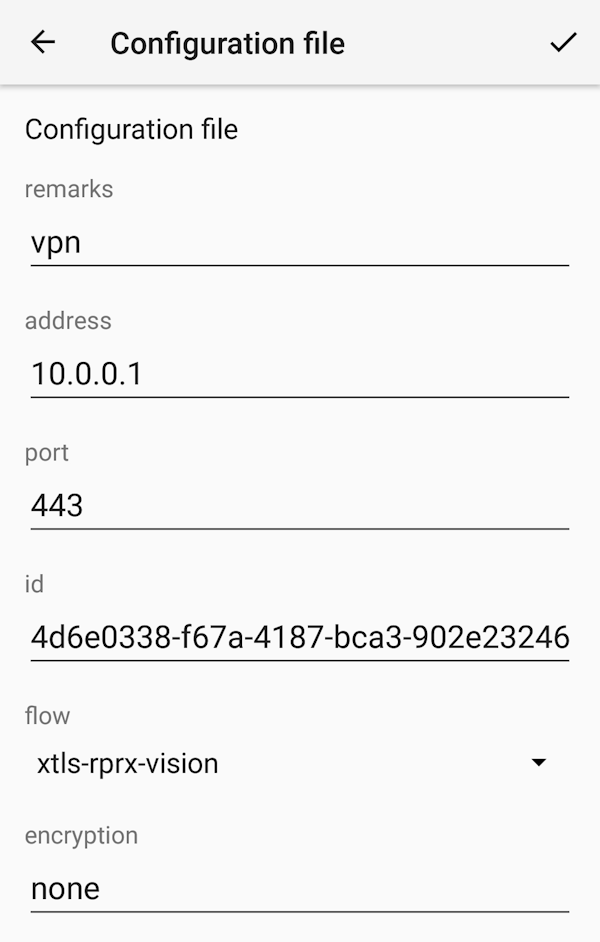

2. Scroll and change the following settings:

   * Select _tcp_ as a _Network_.
   * Open _TLS_ menu and select _reality_.
   * Fill in _SNI_ field with a [chosen whitelisted domain](#choose_domain).
   * Select _chrome_ as a _Fingerprint_.

   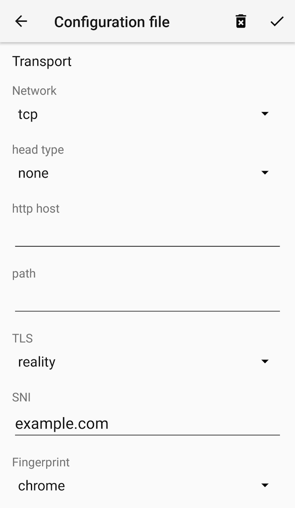

3. Fill in _PublicKey_ field with a key that [you generated](#generate_key).

   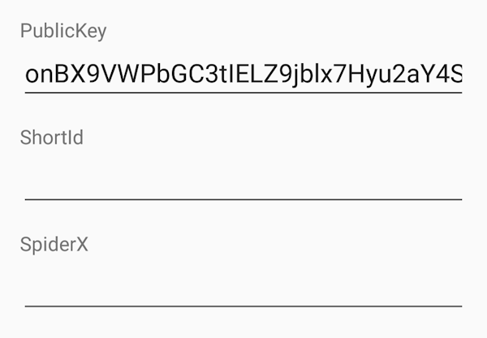

4. Save your configuration:

   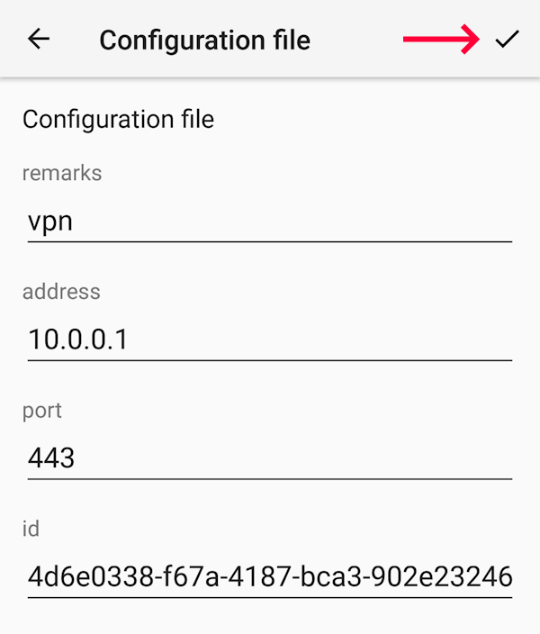

5. Activate VPN and [check your connection](#check_connection).

### Step 5.4 - gRPC transport

Xray Reality is often marketed as something that is hard or maybe impossible to block.
In reality (no pun intended) it gets blocked. If that happened to you,
the one thing you can try is to switch from a `tcp`/`raw` transport to the `grpc` transport.

The configuration of a _server_ is mostly the same as in [Step 5.1](#step-51---xray-reality-server-configuration)
with the following differences:

* Remove `"flow": "xtls-rprx-vision"` from all of your clients. The `grpc` transport doesn't support it.
* Change `"network": "raw"` or `"network": "tcp"` to `"network": "grpc"`.
* Add a basic `grpcSettings` configuration. `serviceName` should match between a client and server.

<details>

<summary>Your Reality server with the gRPC transport will look as follows:</summary>

<a name="reality_grpc_server"></a>

```json
{
    "log": {
        "loglevel": "warning"
    },
    "inbounds": [
        {
            "port": 443,
            "protocol": "vless",
            "settings": {
                "clients": [
                    {
                        "id": "4d6e0338-f67a-4187-bca3-902e232466bc",
                        "email": "John"
                    }
                ],
                "decryption": "none"
            },
            "streamSettings": {
                "network": "grpc",
                "security": "reality",
                "realitySettings": {
                    "dest": "example.com:443",
                    "serverNames": [
                        "example.com"
                    ],
                    "privateKey": "iOEARLzm7u7VJoygXXK8b1Nt6eQsoyYgFP8_3cOLtXE",
                    "shortIds": [
                        ""
                    ]
                },
                "grpcSettings": {
                    "serviceName": "/somename"
                }
            }
        }
    ],
    "outbounds": [
        {
            "protocol": "freedom"
        }
    ]
}
```

</details>

</br>

The _client_ configuration is nearly identical to the one in [Step 5.2](#step-52---xray-reality-socks-proxy-client-configuration).

Except, with the following changes:

* Remove `"flow": "xtls-rprx-vision"`, as already mentioned this is not supported when using `grpc`.
* Change `network` to `grpc`.
* Add `grpcSettings` with a `multiMode` set to `true` and a `serviceName`
that you specified in the [server configuration](#reality_grpc_server).

  Enabling the `multiMode` is essential, otherwise I get a bunch of `ERR_SSL_PROTOCOL_ERROR` errors in my browser.

<details>

<summary>Your Reality client modified for gRPC will look like this:</summary>

```json
{
    "log": {
        "loglevel": "warning"
    },
    "inbounds": [
        {
            "listen": "127.0.0.1",
            "port": "1080",
            "protocol": "socks",
            "settings": {
                "udp": true,
                "ip": "127.0.0.1"
            }
        }
    ],
    "outbounds": [
        {
            "protocol": "vless",
            "settings": {
                "address": "10.0.0.1",
                "port": 443,
                "id": "4d6e0338-f67a-4187-bca3-902e232466bc",
                "encryption": "none"
            },
            "streamSettings": {
                "network": "grpc",
                "security": "reality",
                "realitySettings": {
                    "fingerprint": "chrome",
                    "serverName": "example.com",
                    "password": "onBX9VWPbGC3tIELZ9jblx7Hyu2aY4SPag1oxXHE41M",
                    "shortId": ""
                },
                "grpcSettings": {
                    "serviceName": "/somename",
                    "multiMode": true
                }
            }
        }
    ]
}
```

</details>

</br>

How to configure Xray Reality on Android is explained in [Step 5.3](#step-53---xray-reality-android-client-configuration).
To make it work with the `grpc` transport do the following:

1. Deselect the flow, it should be empty:

   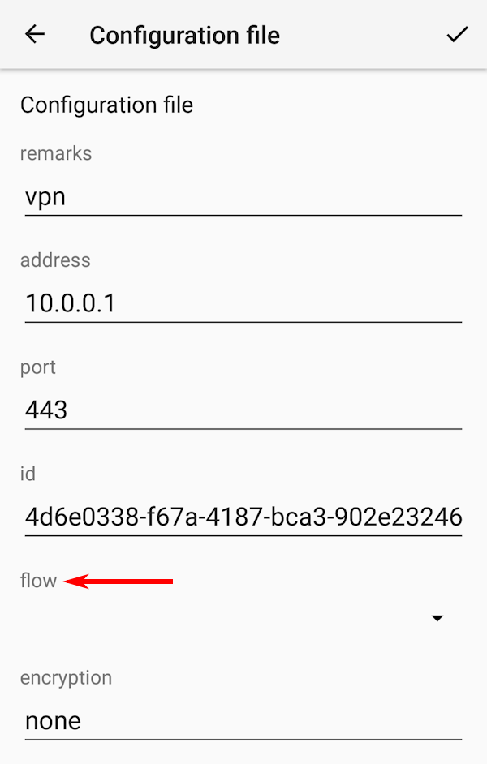

2. In the _Network_ menu select _grpc_.

3. Select _multi_ as a _gRPC mode_.

4. Fill in the _gRPC serviceName_ with the same value as in the [server configuration](#reality_grpc_server).

   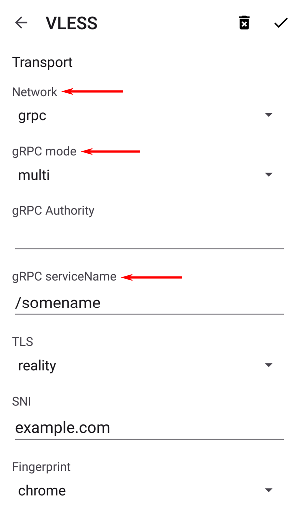

5. Save your changes.

6. Now, you can [test your connection](#check_connection).

### Step 5.5 - Further reading

* [Description of XTLS Vision](https://github.com/seakfind/examples/blob/main/xtls-vision/README.md).
* [How Reality works](https://github.com/XTLS/REALITY/blob/main/README.en.md).

## Step 6 - Blocking ads

As an alternative to a browser extension like uBlock Origin you can use Xray itself to block a large portion of ads.

Ad blocking can be achieved by adjusting your [Xray client](#step-321---socks-proxy) configuration as follows:

* Add a new outbound to the `outbounds` array, which will be used for blocking:

  ```json
  {
      "protocol": "blackhole",
      "tag": "block"
  }
  ```

  Make sure to add it **after** the outbound you had previously.
  The first outbound in the array is the default one.

* Now, add the `routing` section to your top-level configuration object:

  ```
  "routing": {
      "rules": [
          {
              "type": "field",
              "outboundTag": "block",
              "domain": [
                  "geosite:category-ads-all"
              ]
          }
      ]
  }
  ```

  This routing configuration blocks all domains that belongs to [category-ads-all](https://github.com/v2fly/domain-list-community/blob/master/data/category-ads-all). You can use other [lists of domains](https://github.com/v2fly/domain-list-community) for blocking with `geosite:` prefix.

<details>

<summary>The resulting client configuration with ad blocking:</summary>

```json
{
    "log": {
        "loglevel": "warning"
    },
    "inbounds": [
        {
            "listen": "127.0.0.1",
            "port": "1080",
            "protocol": "socks",
            "settings": {
                "udp": true,
                "ip": "127.0.0.1"
            }
        }
    ],
    "outbounds": [
        {
            "protocol": "vless",
            "settings": {
                "vnext": [
                    {
                        "address": "example.com",
                        "port": 443,
                        "users": [
                            {
                                "id": "4d6e0338-f67a-4187-bca3-902e232466bc",
                                "encryption": "none",
                                "level": 0
                            }
                        ]
                    }
                ]
            },
            "streamSettings": {
                "network": "tcp",
                "security": "tls",
                "tlsSettings": {
                    "allowInsecure": false
                }
            }
        },
        {
            "protocol": "blackhole",
            "tag": "block"
        }
    ],
    "routing": {
        "rules": [
            {
                "type": "field",
                "outboundTag": "block",
                "domain": [
                    "geosite:category-ads-all"
                ]
            }
        ]
    }
}
```

</details>

## Step 6.1 - Blocking adult websites

Similarly to ads you can block adult websites, adjust your routing accordingly by adding a new item to the `domain` array:

```
"routing": {
    "rules": [
        {
            "type": "field",
            "outboundTag": "block",
            "domain": [
                "geosite:category-ads-all",
                "geosite:category-porn"
            ]
        }
    ]
}
```

<details>

<summary>The resulting client configuration with ads and adult websites blocked:</summary>

```json
{
    "log": {
        "loglevel": "warning"
    },
    "inbounds": [
        {
            "listen": "127.0.0.1",
            "port": "1080",
            "protocol": "socks",
            "settings": {
                "udp": true,
                "ip": "127.0.0.1"
            }
        }
    ],
    "outbounds": [
        {
            "protocol": "vless",
            "settings": {
                "vnext": [
                    {
                        "address": "example.com",
                        "port": 443,
                        "users": [
                            {
                                "id": "4d6e0338-f67a-4187-bca3-902e232466bc",
                                "encryption": "none",
                                "level": 0
                            }
                        ]
                    }
                ]
            },
            "streamSettings": {
                "network": "tcp",
                "security": "tls",
                "tlsSettings": {
                    "allowInsecure": false
                }
            }
        },
        {
            "protocol": "blackhole",
            "tag": "block"
        }
    ],
    "routing": {
        "rules": [
            {
                "type": "field",
                "outboundTag": "block",
                "domain": [
                    "geosite:category-ads-all",
                    "geosite:category-porn"
                ]
            }
        ]
    }
}
```

</details>

## Step 6.2 - Blocking specific time-wasters

If you have specific websites where you tend to waste your time, you can block them individually,
instead of using the categories mentioned above. This will create friction, and you will stop visiting them.

The routing configuration with specific websites blocked looks as follows:

```
"routing": {
    "rules": [
        {
            "type": "field",
            "outboundTag": "block",
            "domain": [
                "full:www.reddit.com",
                "full:news.ycombinator.com",
                "full:hn.algolia.com",
                "full:x.com"
            ]
        }
    ]
}
```

If you want to block subdomains of the particular domain, you can use `domain:` instead of `full:`.
For example, `domain:reddit.com` will block `reddit.com` and its subdomains like `www.reddit.com`.

<details>

<summary>The resulting client configuration with time-wasters blocked:</summary>

```json
{
    "log": {
        "loglevel": "warning"
    },
    "inbounds": [
        {
            "listen": "127.0.0.1",
            "port": "1080",
            "protocol": "socks",
            "settings": {
                "udp": true,
                "ip": "127.0.0.1"
            }
        }
    ],
    "outbounds": [
        {
            "protocol": "vless",
            "settings": {
                "vnext": [
                    {
                        "address": "example.com",
                        "port": 443,
                        "users": [
                            {
                                "id": "4d6e0338-f67a-4187-bca3-902e232466bc",
                                "encryption": "none",
                                "level": 0
                            }
                        ]
                    }
                ]
            },
            "streamSettings": {
                "network": "tcp",
                "security": "tls",
                "tlsSettings": {
                    "allowInsecure": false
                }
            }
        },
        {
            "protocol": "blackhole",
            "tag": "block"
        }
    ],
    "routing": {
        "rules": [
            {
                "type": "field",
                "outboundTag": "block",
                "domain": [
                    "domain:reddit.com",
                    "full:news.ycombinator.com",
                    "full:hn.algolia.com",
                    "full:x.com"
                ]
            }
        ]
    }
}
```

</details>


## Conclusion

Xray is a good solution when your primary use case is to access blocked websites and apps. Contrary to popular VPN protocols it's not easy to block. The drawback is obviously its documentation, which is Chinese oriented.

Now, when you have a basic idea how to configure Xray, you can tweak its configuration for your own needs. Depending on what kind of blocking you want to circumvent, you may need to employ different techniques. Read the [Xray config reference](https://xtls.github.io/en/config/) and check the [repository full of configuration examples](https://github.com/XTLS/Xray-examples) to learn more.

Hopefully you now have your Xray server running and your Internet browsing is free from artificial restrictions. At least until a new kind of blocking is rolled out :)

##### License: MIT

<!--

Contributor's Certificate of Origin

By making a contribution to this project, I certify that:

(a) The contribution was created in whole or in part by me and I have
    the right to submit it under the license indicated in the file; or

(b) The contribution is based upon previous work that, to the best of my
    knowledge, is covered under an appropriate license and I have the
    right under that license to submit that work with modifications,
    whether created in whole or in part by me, under the same license
    (unless I am permitted to submit under a different license), as
    indicated in the file; or

(c) The contribution was provided directly to me by some other person
    who certified (a), (b) or (c) and I have not modified it.

(d) I understand and agree that this project and the contribution are
    public and that a record of the contribution (including all personal
    information I submit with it, including my sign-off) is maintained
    indefinitely and may be redistributed consistent with this project
    or the license(s) involved.

Signed-off-by: wpdevelopment11 wpdevelopment11@gmail.com

-->
